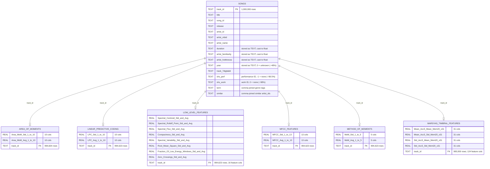
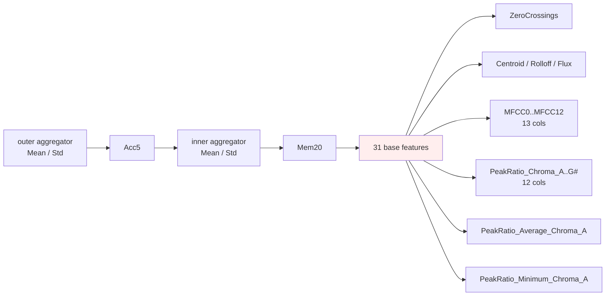
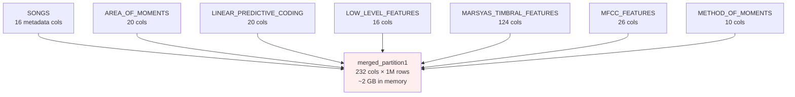

# MSD SQLite Schema

DB: `data/MSD_with_all_features.db` — 8 tables, no declared foreign keys. All inter-table links go through `track_id`.

> **Render this file**: open in VS Code with the *Markdown Preview Mermaid Support* extension, or paste the diagram block into <https://mermaid.live>.

## Logical ER (normalized — what you should mentally model)

## How `MARSYAS_TIMBRAL_FEATURES` 124 cols are organized

`{outer}_Acc5_{inner}_Mem20_<feature>_..._AudioCh0`, where outer/inner ∈ {Mean, Std} (4 combos) × 31 features.

Total = 4 × 31 = **124** feature columns + `track_id` = 125.

## The denormalized table (separate from the ER above)

`merged_partition1` is a **flat join** of all 7 tables: 16 metadata + 216 audio feature columns = **232 columns × 1,000,000 rows**. It is **not** a normalized entity — it duplicates everything you can already get by joining the others on `track_id`. Loading the full table costs ~2 GB of RAM.

## Quick reference: cardinalities

| Table | Rows | "Missing" tracks vs songs |
|---|---:|---:|
| `songs` | 1,000,000 | — (canonical track set) |
| `marsyas_timbral_features` | 995,000 | 5,000 |
| `linear_predictive_coding` | 994,623 | 5,377 |
| `low_level_features` | 994,623 | 5,377 |
| `mfcc_features` | 994,623 | 5,377 |
| `method_of_moments` | 994,623 | 5,377 |
| `area_of_moments` | 994,604 | 5,396 |
| `merged_partition1` | 1,000,000 | 0 (NULLs filled where features absent) |

⚠️ The 5k–5.4k rows missing from each feature table do **not** fully overlap with `songs` — an `INNER JOIN` across all six on `track_id` gives slightly fewer than 994,604 rows.
